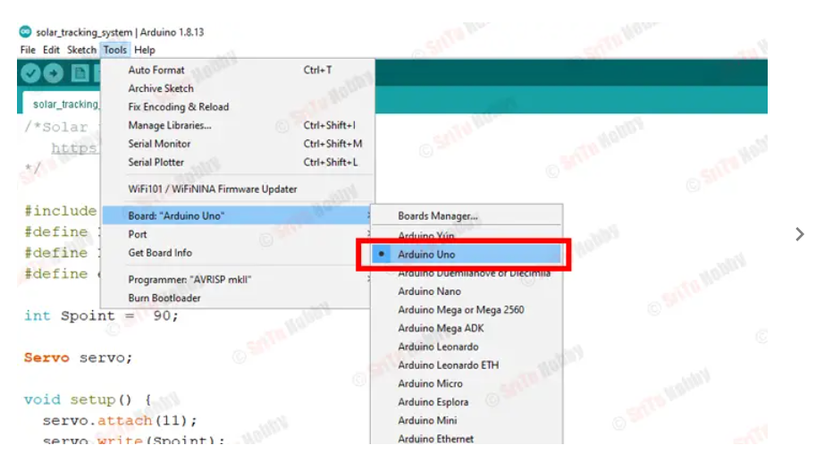
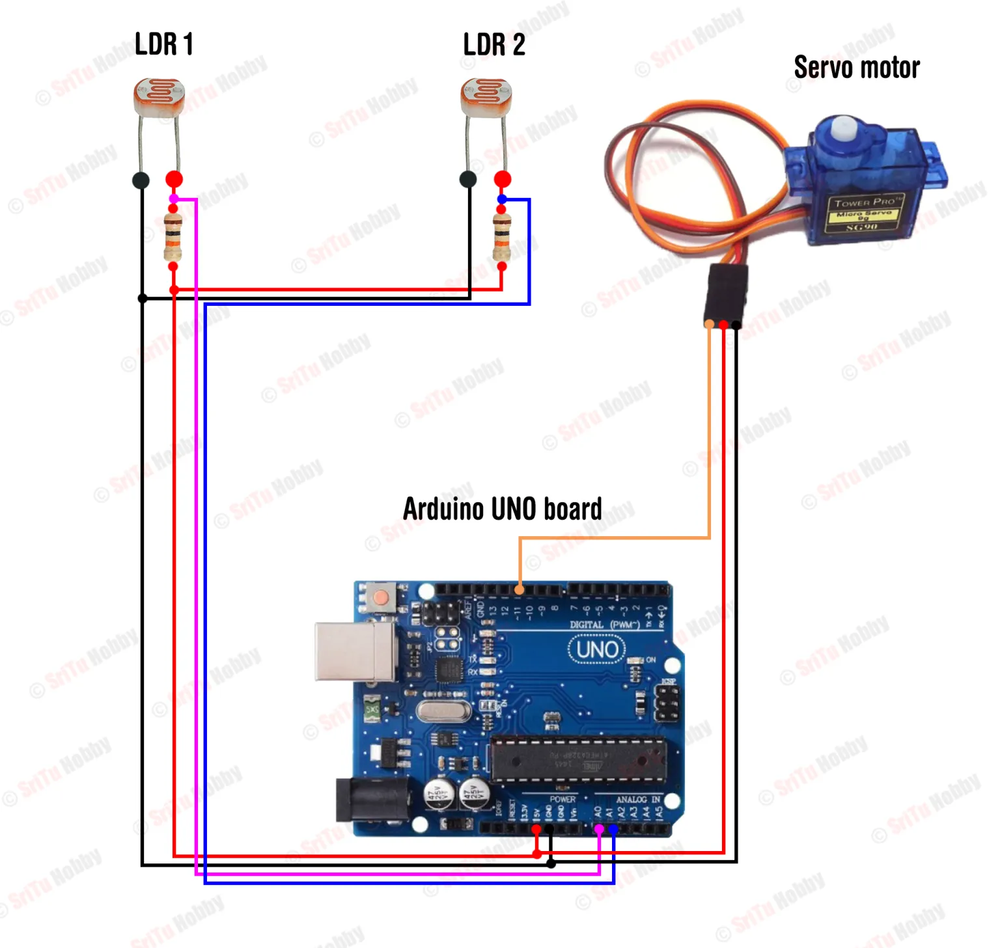
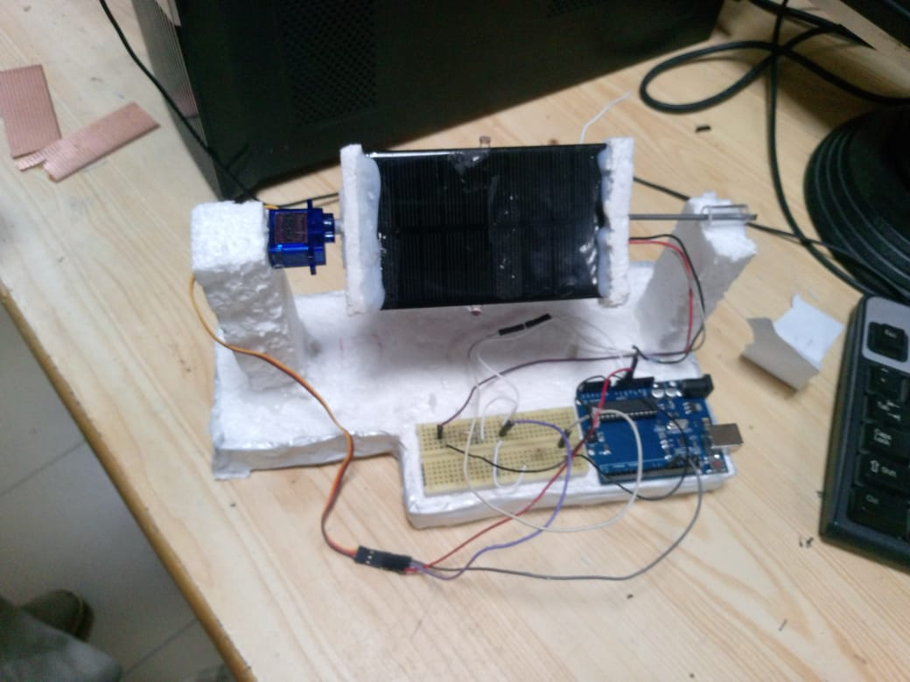

# 🌞 Solar Tracker Using Arduino

This project automatically rotates a servo motor toward the brightest light source using two LDR sensors. It increases the efficiency of solar panels by tracking sunlight throughout the day.

---

## ✅ Features

* Two LDR-based light detection
* Automatic servo rotation
* Smooth tracking movement
* Works on real hardware and Proteus simulation

---

## 🔧 Components Required

| Component          | Quantity  |
| ------------------ | --------- |
| Arduino Uno / Nano | 1         |
| LDR Sensors        | 2         |
| 10K Resistors      | 2         |
| Servo Motor        | 1         |
| Wires & Breadboard | As needed |

---
##     Arduino Diagram 
Below is the ardunio how you select the port and push the code in the arduino

## 🔌 Circuit Diagram

Add your circuit diagram here:

---

## 🖥 Proteus Simulation

This project can be simulated in Proteus. Components needed:

* Arduino module
* Servo motor
* Two LDRs
* Resistors

Upload the same Arduino code, and the servo will rotate based on simulated light changes.

Add Proteus screenshot here:

---

## 🚀 Code File

The Arduino code is included in `solar_tracker_code.ino`.

---

## 📷 Project Images

Add real project images here:

---

## ✍️ Author

**Tahir Ali**
Electrical Engineer | AI/ML Engineer

---

## ✅ License

This project uses **MIT License**. See `LICENSE` file.
